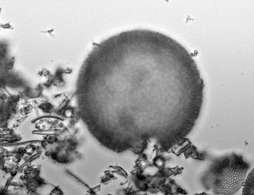
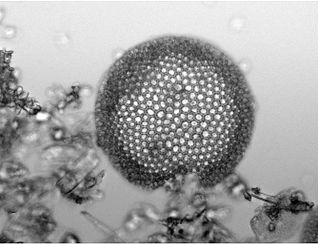
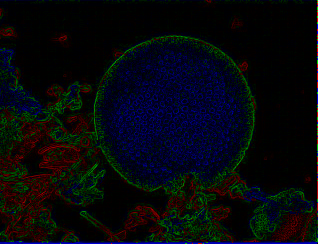

### Run:
```bash
$ python pipe.py
```

Task1
Lab provided data in *resources* dir.
Will plot any intermediate results into *results* directory.

### Given data




### Results (contribution map + result)



